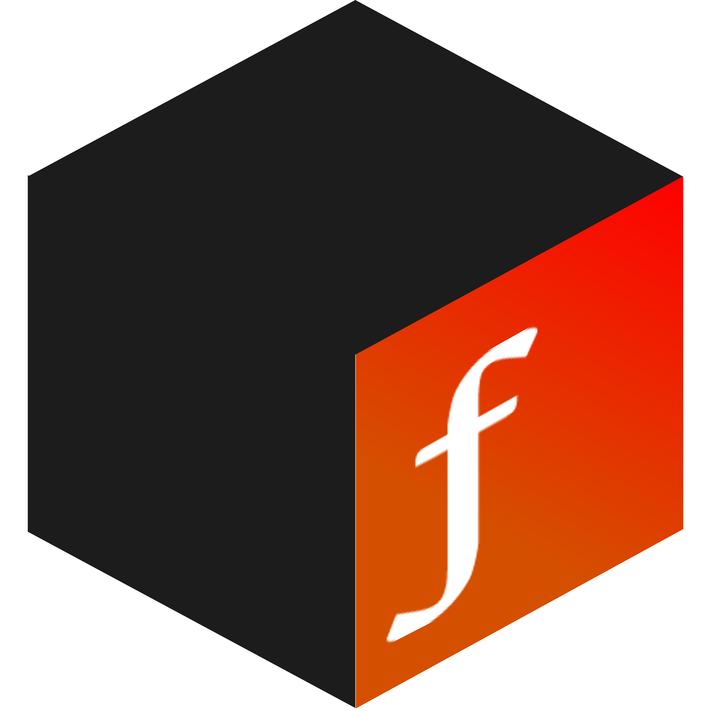

  
  
  # TrueForge
  
  **A fast, lightweight font rasterizer written in pure Rust**
  
  
  
  
  

---

## Overview

TForge is a high-performance CPU-based font rasterizer designed for speed and simplicity. It uses winding number algorithms for accurate glyph rendering with adaptive bezier curve tessellation, making it ideal for both desktop applications and embedded systems.
To stay dependency free it also includes its own basic parser for True Type Font files which handles:
- CMAP
- GLYF
- HEAD
- HHEA
- HMTX
- KERN
- LOCA
- MAXP

## Features

- 🚀 **Fast**
- 🦀 **Dependency free**
- 🧠 **Simple kerning, metrics and caching**
- 🎯 **Accurate** — Winding number algorithm for precise fill operations
- 📦 **`no_std` Compatible** — Works in bare-metal environments out of the box!
- ⚡ **Adaptive Tessellation** — Smart curve flattening based on complexity
- 🎨 **Anti-aliased** — Smooth, high-quality glyph rendering

## Performance

